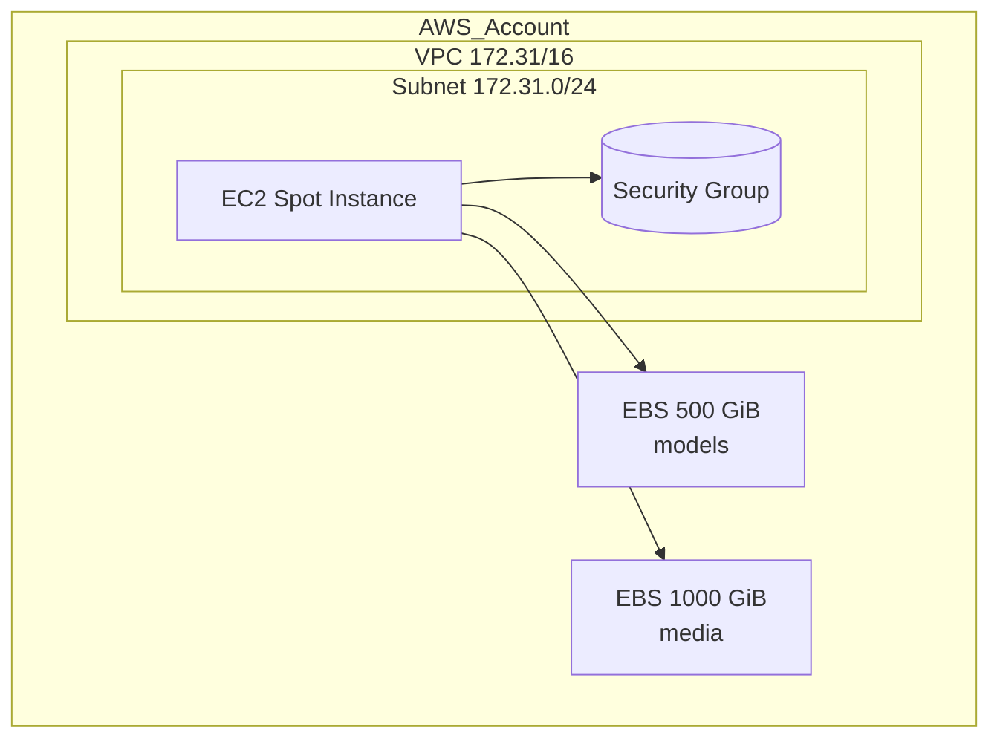

# ComfyUI GPU Spot Stack on AWS

ComfyUI is a powerful node based interface for image and video generation.  
This project spins up a cost efficient GPU environment on AWS Spot Instances, with persistent EBS volumes for models and media. Terraform automates every resource and a tiny `userdata` script installs and runs ComfyUI at boot.

## Table of contents
- [ComfyUI GPU Spot Stack on AWS](#comfyui-gpu-spot-stack-on-aws)
  - [Table of contents](#table-of-contents)
  - [1. Overview](#1-overview)
  - [2. Architecture diagram](#2-architecture-diagram)
  - [3. Prerequisites](#3-prerequisites)
  - [4. First-time setup](#4-first-time-setup)
    - [4.1 Configure the AWS CLI](#41-configure-the-aws-cli)
    - [4.2 Import your public key into EC2](#42-import-your-public-key-into-ec2)
    - [4.3 Clone and prepare the repo](#43-clone-and-prepare-the-repo)
    - [4.4 Initialise Terraform](#44-initialise-terraform)
    - [4.5 Create the stack](#45-create-the-stack)
  - [5. Everyday workflow](#5-everyday-workflow)
  - [6. Starting and stopping the instance](#6-starting-and-stopping-the-instance)
    - [via AWS CLI](#via-aws-cli)
    - [via Terraform](#via-terraform)
  - [7. Managing AWS profiles and key pairs](#7-managing-aws-profiles-and-key-pairs)
  - [8. Customisation cheatsheet](#8-customisation-cheatsheet)
  - [9. Troubleshooting](#9-troubleshooting)
  - [10. Cleaning up](#10-cleaning-up)
  - [11. License](#11-license)

---

## 1. Overview

* One Spot instance of type **g6.12xlarge** or any other G family size you set.  
* Two GP3 volumes  
  * `/mnt/models` for checkpoints, LoRAs, VAEs, etc  
  * `/mnt/media` for generated images and videos  
* User `ubuntu` runs ComfyUI as a systemd service on port **8188**.  
* Volumes survive instance stop events, so you only pay for storage when the GPU is off.  

---

## 2. Architecture diagram



---

## 3. Prerequisites

| Tool | Minimum version | Install command |
| :--- | :-------------- | :-------------- |
| Terraform | 1.6 | <https://developer.hashicorp.com/terraform/downloads> |
| AWS CLI  | 2.15 | `brew install awscli` or MSI on Windows |
| Git      | any recent | <https://git-scm.com/downloads> |
| An SSH key | ED25519 is recommended | `ssh-keygen -t ed25519 -C "comfyui"` |

---

## 4. First-time setup

### 4.1 Configure the AWS CLI

```bash
aws configure --profile your_aws_profile_name
````

Enter the Access Key, Secret Key and default region `us-east-1`.

### 4.2 Import your public key into EC2

```bash
aws ec2 import-key-pair \
  --key-name comfyui \
  --public-key-material fileb://~/.ssh/id_ed25519.pub \
  --profile your_aws_profile_name --region us-east-1
```

### 4.3 Clone and prepare the repo

```bash
git clone https://github.com/yourname/comfyui-terraform-spot-instance.git
cd comfyui-terraform-spot-instance
```

Copy **`secrets.auto.tfvars.example`** to **`secrets.auto.tfvars`** and fill:

```hcl
aws_profile = "your_aws_profile_name"
aws_region  = "us-east-1"
key_name    = "comfyui"
instance_type = "g6.12xlarge"   # or any other G size
availability_zone = "us-east-1a"

# leave this line out or set to "on-demand" for standard pricing
#purchase_option  = "spot"
```

The file is already ignored by Git.

### 4.4 Initialise Terraform

```bash
terraform init
terraform fmt     # optional pretty print
terraform validate
```

### 4.5 Create the stack

```bash
terraform apply
```

Type **yes** when asked.
The first run takes about three minutes.

---

## 5. Everyday workflow

1. `terraform apply -var "instance_type=g6.4xlarge"` to resize if quotas change.
2. Generate images in ComfyUI at `http://public-ip:8188`.
3. When done, stop the instance to save money

   ```bash
   aws ec2 stop-instances --instance-ids i-xxxxxxxxxxxxxxxxx --profile your_aws_profile_name
   ```
4. Start next time with

   ```bash
   aws ec2 start-instances --instance-ids i-xxxxxxxxxxxxxxxxx --profile your_aws_profile_name
   ```

---

## 6. Starting and stopping the instance

### via AWS CLI

```bash
# Start
aws ec2 start-instances --instance-ids i-1234567890abcdef0 --profile your_aws_profile_name

# Stop (billing pauses for compute, volumes keep billing)
aws ec2 stop-instances --instance-ids i-1234567890abcdef0 --profile your_aws_profile_name
```

### via Terraform

```bash
terraform apply -target=aws_instance.comfy  # creates or starts
terraform destroy -target=aws_instance.comfy  # terminates instance only
```

Volumes remain because of `skip_destroy = true`.

---

## 7. Managing AWS profiles and key pairs

* List profiles

  ```bash
  aws configure list-profiles
  ```
* Switch profile for Terraform

  ```bash
  export AWS_PROFILE=myotherprofile
  ```
* List key pairs

  ```bash
  aws ec2 describe-key-pairs --query "KeyPairs[*].KeyName" --region us-east-1
  ```
* Delete a key

  ```bash
  aws ec2 delete-key-pair --key-name oldkey --region us-east-1
  ```

---

## 8. Customisation cheatsheet

| What to change    | How                                                                      |
| :---------------- | :----------------------------------------------------------------------- |
| GPU size          | `instance_type` variable                                                 |
| Region or AZ      | `aws_region` and `availability_zone` variables, plus update volume zones |
| Model volume size | `size` in `aws_ebs_volume.models`                                        |
| Media volume size | `size` in `aws_ebs_volume.media`                                         |
| Extra ports       | add more `ingress` blocks in the security group                          |

---

## 9. Troubleshooting

| Symptom                                       | Cause                               | Fix                                                                          |
| :-------------------------------------------- | :---------------------------------- | :--------------------------------------------------------------------------- |
| `Blocked: This account is currently blocked…` | Account not fully verified          | Open a support ticket under **Account and billing → Account**                |
| `InvalidKeyPair.NotFound`                     | Key name mismatch                   | Run `aws ec2 import-key-pair` or update `key_name`                           |
| `No default VPC`                              | New accounts come with none         | This repo creates its own VPC, ensure `vpc_id` is set on security group      |
| `MaxSpotInstanceCountExceeded`                | Spot quota too low                  | Request a quota increase for **All G and VT Spot Instances**                 |
| `function env not found` in Terraform         | Wrong syntax                        | Use `pathexpand("~/.ssh/id_ed25519.pub")`                                    |
| SSH timeout                                   | Security group closed or IP changed | Verify port 22 in inbound rules and check the new public IP after each start |
| Changing AWS-CLI profile on Windows          | Environment variable not set        | Set `$Env:AWS_PROFILE = "your_aws_profile_name"` in the terminal before running commands |

---

## 10. Cleaning up

```bash
terraform destroy
```

All resources are removed.
If you want to keep volumes only:

```bash
terraform destroy \
  -target=aws_instance.comfy \
  -target=aws_security_group.comfy
```

---

## 11. License

MIT License unless stated otherwise.
Feel free to fork and improve.

```
